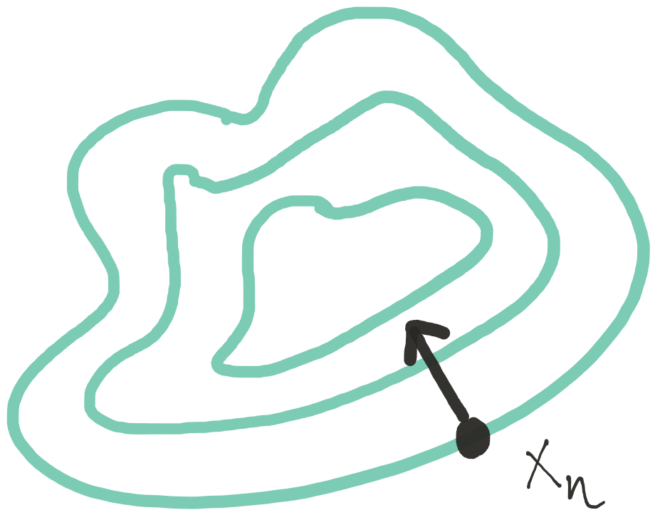
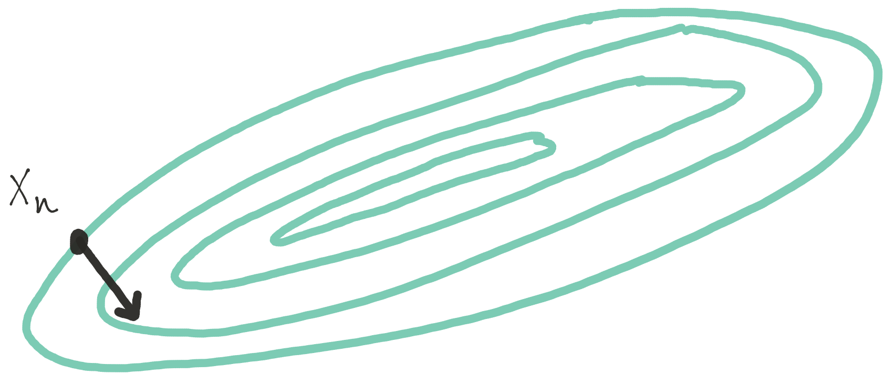

# General Optimization

```{r, include=FALSE}
knitr::opts_chunk$set(comment = NA)
```

The general optimization problem can be stated as follows. Given a fiunction $f: \mathbb{R}^k\rightarrow\mathbb{R}$, we want to find $\min_{x\in S}f(x)$, where $S\subset\mathbb{R}^k$. The general approach to solving this problem that we will discuss is called a *line search method*. With line search methods, given $f$ and a current estimate $x_n$ of the location of the minimum, we want to 

1. Choose a direction $p_n$ in $k$-dimensional space;

2. Choose a step length in the direction $p_n$, usually by solving $\min_{\alpha>0} f(x_n + \alpha p_n)$ to get $\alpha_n$

3. Update our estimate with $x_{n+1} = x_n + \alpha_n p_n$.

Clearly then, with line search methods, the two questions one must answer are how should we choose the direction? and how far should we step? Almost all line search approaches provide variations on the answers to those two questions.

Care must be taken in addressing the problems involved with line search methods because typically one must assume that the size of the parameter space is large (i.e. $k$ is large). Therefore, one of constraints for all methods is minimizing the amount of computation that needs to be done due to the large parameter space. Efficiency with respect to memory (storage of data or parameters) and computation time is key.


## Steepest Descent

Perhaps the most obvious direction to choose when attempting to minimize a function $f$ starting at $x_n$ is the direction of *steepest descent*, or $-f^\prime(x_n)$. This is the direction that is orthogonal to the contours of $f$ at the point $x_n$ and hence is the direction in which $f$ is changing most rapidly at $x_n$.



The updating procedure for a steepest descent algorithm, given the current estimate $x_n$, is then

\[
x_{n+1} = x_n - \alpha_n f^\prime(x_n)
\]

While it might seem logical to always go in the direction of steepest descent, it can occasionally lead to some problems. In particular, when certain parameters are highly correlated with each other, the steepest descent algorithm can require many steps to reach the minimum. 

The figure below illustrates a function whose contours are highly correlated and hence elliptical. 




Depending on the starting value, the steepest descent algorithm could take many steps to wind its way towards the minimum. 


### Example: Multivariate Normal

One can use steepest descent to compute the maximum likelihood estimate of the mean in a multivariate Normal density, given a sample of data. However, when the data are highly correlated, as they are in the simulated example below, the log-likelihood surface can be come difficult to optimize. In such cases,  a very narrow ridge develops in the log-likelihood that can be difficult for the steepest descent algorithm to navigate.

In the example below, we actually compute the *negative* log-likelihood because the algorith is designed to *minimize* functions.

```{r}
set.seed(2017-08-10)
mu <- c(1, 2)
S <- rbind(c(1, .9), c(.9, 1))
x <- MASS::mvrnorm(500, mu, S)
nloglike <- function(mu1, mu2) {
        dmv <- mvtnorm::dmvnorm(x, c(mu1, mu2), S, log = TRUE)
        -sum(dmv)
}
nloglike <- Vectorize(nloglike, c("mu1", "mu2"))
nx <- 40
ny <- 40
xg <- seq(-5, 5, len = nx)
yg <- seq(-5, 6, len = ny)
g <- expand.grid(xg, yg)
nLL <- nloglike(g[, 1], g[, 2])
z <- matrix(nLL, nx, ny)
par(mar = c(4.5, 4.5, 1, 1))
contour(xg, yg, z, nlevels = 40, xlab = expression(mu[1]), 
        ylab = expression(mu[2]))
abline(h = 0, v = 0, lty = 2)
```

Note that in the figure above the surface is highly stretched and that the minimum $(1, 2)$ lies in the middle of a narrow valley. For the steepest descent algorithm we will start at the point $(-5, -2)$ and track the path of the algorithm. 

```{r}
library(dplyr, warn.conflicts = FALSE)
norm <- function(x) x / sqrt(sum(x^2))
Sinv <- solve(S)  ## I know I said not to do this!
step1 <- function(mu, alpha = 1) {
        D <- sweep(x, 2, mu, "-")
        score <- colSums(D) %>% norm
        mu + alpha * drop(Sinv %*% score)
}
steep <- function(mu, n = 10, ...) {
        results <- vector("list", length = n)
        for(i in seq_len(n)) {
                results[[i]] <- step1(mu, ...)
                mu <- results[[i]]
        }
        results
}
m <- do.call("rbind", steep(c(-5, -2), 8))
m <- rbind(c(-5, -2), m)

par(mar = c(4.5, 4.5, 1, 1))
contour(xg, yg, z, nlevels = 40, xlab = expression(mu[1]), 
        ylab = expression(mu[2]))
abline(h = 0, v = 0, lty = 2)
points(m, pch = 20, type = "b")
```

We can see that the path of the algorthm is rather winding as it traverses the narrow valley. Now, we have fixed the step-length in this case, which is probably not optimal. However, one can still see that the algorithm has some difficulty navigating the surface because the direction of steepest descent does not take one directly towards the minimum ever.


## The Newton Direction 

Given a current best estimate $x_n$, we can approximate $f$ with a quadratic polynomial. For some small $p$,

\[
f(x_n + p)
\approx
f(x_n) + p^\prime f^\prime(x_n) + \frac{1}{2}p^\prime f^{\prime\prime}(x_n)p.
\]

If we minimize the right hand side with respect to $p$, we obtain 
\[
p_n = f^{\prime\prime}(x_n)^{-1}[-f^\prime(x_n)]
\]
which we can think of as the steepest descent direction "twisted" by the inverse of the Hessian matrix $f^{\prime\prime}(x_n)^{-1}$. Newton's method has a "natural" step length of $1$, so that the updating procedure is

\[
x_{n+1} = x_n - f^{\prime\prime}(x_n)^{-1}f^\prime(x_n).
\]

Newton's method makes a quadratic approximation to the target function $f$ at each step of the algorithm. This follows the "optimization transfer" principle mentioned earlier, whereby we take a complex function $f$, replace it with a simpler function $g$ that is easier to optimize, and then optimize the simpler function repeatedly until convergence to the solution.

We can visualize how Newton's method makes its quadratic approximation to the target function easily in one dimension. 


```{r}
curve(-dnorm(x), -2, 3, lwd = 2, ylim = c(-0.55, .1))
xn <- -1.2
abline(v = xn, lty = 2)
axis(3, xn, expression(x[n]))
g <- function(x) {
        -dnorm(xn) + (x-xn) * xn * dnorm(xn) - 0.5 * (x-xn)^2 * (dnorm(xn) - xn * (xn * dnorm(xn)))
}
curve(g, -2, 3, add = TRUE, col = 4)
op <- optimize(g, c(0, 3))
abline(v = op$minimum, lty = 2)
axis(3, op$minimum, expression(x[n+1]))


```

In the above figure, the next iterate, $x_{n+1}$ is actually further away from the minimum than our previous iterate $x_n$. The quadratic approximation that Newton's method makes to $f$ is not guaranteed to be good at every point of the function. 

This shows an important "feature" of Newton's method, which is that it is not *monotone*. The successive iterations that Newton's method produces are not guaranteed to be improvements in the sense that each iterate is closer to the truth. The tradeoff here is that while Newton's method is very fast (quadratic convergence), it can be unstable at times. Monotone algorithms (like the EM algorithm that we discuss later) that always produce improvements, are more stable, but generally converge at slower rates. 

In the next figure, however, we can see that the solution provided by the next approximation, $x_{n+2}$, is indeed quite close to the true minimum.


```{r}
curve(-dnorm(x), -2, 3, lwd = 2, ylim = c(-0.55, .1))
xn <- -1.2
op <- optimize(g, c(0, 3))
abline(v = op$minimum, lty = 2)
axis(3, op$minimum, expression(x[n+1]))

xn <- op$minimum
curve(g, -2, 3, add = TRUE, col = 4)
op <- optimize(g, c(0, 3))
abline(v = op$minimum, lty = 2)
axis(3, op$minimum, expression(x[n+2]))
```


It is worth noting that in the rare event that $f$ is in fact a quadratic polynomial, Newton's method will converge in a single step because the quadratic approximation that it makes to $f$ will be exact. 

### Generalized Linear Models

The generalized linear model is an extension of the standard linear model to allow for non-Normal response distributions. The distributions used typically come from an exponential family whose density functions share some common characteristics. With a GLM, we typical present it as $y_i\sim p(y_i\mid\mu_i)$, where $p$ is an exponential family distribution, $\mathbb{E}[y_i]=\mu_i$, 
\[
g(\mu_i) = x_i^\prime\beta,
\]
where $g$ is a nonlinear link function, and $\text{Var}(y_i) = V(\mu)$ where $V$ is a known variance function.

Unlike the standard linear model, the maximum likelihood estimate of the parameter vector $\beta$ cannot be obtained in closed form, so an iterative algorithm must be used to obtain the estimate. The traditional algorithm used is the Fisher scoring algorithm. This algorithm uses a linear approximation to the nonlinear link function $g$, which can be written as
\[
g(y_i)\approx g(\mu_i) + (y_i-\mu_i)g^\prime(\mu_i).
\]
The typical notation of GLMs refers to $z_i=g(\mu_i) + (y_i-\mu_i)g^\prime(\mu_i)$ as the *working response*. The Fisher scoring algorithm then works as follows.

1. Start with $\hat{\mu}_i$, some initial value.

2. Compute $z_i = g(\hat{\mu}_i) + (y_i-\hat{\mu}_i)g^\prime(\hat{\mu}_i)$.

3. Given the $n\times 1$ vector of working responses $z$ and the $n\times p$  predictor matrix $X$ we compute a weighted regression of $z$ on $X$ to get 
\[
\beta_n = (X^\prime WX)^{-1}X^\prime Wz
\]
where $W$ is a diagonal matrix with diagonal elements
\[
w_{ii} = \left[g^\prime(\mu_i)^2V(\mu_i)\right]^{-1}.
\]

4. Given $\beta_n$, we can recompute $\hat{\mu}_i=g^{-1}(x_i^\prime\beta_n)$ and go to 2.

Note that in Step 3 above, the weights are simply the inverses of the variance of $z_i$, i.e. 
\begin{eqnarray*}
\text{Var}(z_i) 
& = & 
\text{Var}(g(\mu_i) + (y_i-\mu_i)g^\prime(\mu_i))\\
& = & 
\text{Var}((y_i-\mu_i)g^\prime(\mu_i))\\
& = & V(\mu_i)g^\prime(\mu_i)^2
\end{eqnarray*}
Naturally, when doing a weighted regression, we would weight by the inverse of the variances.


#### Example: Poisson Regression

For a Poisson regression, we have $y_i\sim\text{Poisson}(\mu_i)$ where $g(\mu) = \log\mu_i = x_i^\prime\beta$ because the log is the canonical link function for the Poisson distribution. We also have $g^\prime(\mu_i) = \frac{1}{\mu_i}$ and $V(\mu_i) = \mu_i$. Therefore, the Fisher scoring algorithm is

1. Initialize $\hat{\mu}_i$, perhaps using $y_i + 1$ (to avoid zeros).

2. Let $z_i = \log\hat{\mu}_i + (y_i-\hat{\mu}_i)\frac{1}{\hat{\mu}_i}$

3. Regression $z$ on $X$ using the weights
\[
w_{ii} = \left[\frac{1}{\hat{\mu}_i^2}\hat{\mu}_i\right]^{-1} = \hat{\mu}_i.
\]

Using the Poisson regression example, we can draw a connection between the usual Fisher scoring algorithm for fitting GLMs and Newton's method. Recall that if $\ell(\beta)$ is the log-likelihood as a function of the regression paramters $\beta$, then the Newton updating scheme is
\[
\beta_{n+1} = \beta_n + \ell^{\prime\prime}(\beta_n)^{-1}[-\ell^\prime(\beta_n)].
\]

The log-likelihoood for a Poisson regression model can be written in vector/matrix form as
\[
\ell(\beta) = y^\prime X\beta - \exp(X\beta)^\prime\mathbf{1}
\]
where the exponential is taken component-wise on the vector $X\beta$. The gradient function is
\[
\ell^\prime(\beta) = X^\prime y - X^\prime \exp(X\beta)
=
X^\prime(y-\mu)
\]
and the Hessian is
\[
\ell^{\prime\prime}(\beta) = -X^\prime W X
\]
where $W$ is a diagonal matrix with the values $w_{ii} = \exp(x_i^\prime\beta)$ on the diagonal. The Newton iteration is then
\begin{eqnarray*}
\beta_{n+1} 
& = & 
\beta_n + (-X^\prime WX)^{-1}(-X^\prime(y-\mu))\\
& = & 
\beta_n + (X^\prime WX)^{-1}XW(z - X\beta_n)\\
& = &
(X^\prime WX)^{-1}X^\prime Wz + \beta_n - (X^\prime WX)^{-1}X^\prime WX\beta_n\\
& = &
(X^\prime WX)^{-1}X^\prime Wz
\end{eqnarray*}
Therefore the iteration is exactly the same as the Fisher scoring algorithm in this case. In general, Newton's method and Fisher scoring will coincide with any generalized linear model using an exponential family with a canonical link function. 


### Newton's Method in R

The `nlm()` function in R implements Newton's method for minimizing a function given a vector of starting values. By default, one does not need to supply the gradient or Hessian functions; they will be estimated numerically by the algorithm. However, for the purposes of improving accuracy of the algorithm, both the gradient and Hessian can be supplied as attributes of the target function. 


As an example, we will use the `nlm()` function to fit a simple logistic regression model for binary data. This model specifies that $y_i\sim\text{Bernoulli}(p_i)$ where
\[
\log\frac{p_i}{1-p_i} = \beta_0 + x_i \beta_1
\]
and the goal is to estimate $\beta$ via maximum likelihood. Given the assumed Bernoulli distribution, we can write the log-likelihood for a single observation as
\begin{eqnarray*}
\log L(\beta) & = & \log\left\{\prod_{i=1}^n p_i^{y_i}(1-p_i)^{1-y_i}\right\}\\
& = & 
\sum_{i=1}^n y_i\log p_i + (1-y_i)\log(1-p_i)\\
& = & 
\sum_{i=1}^n y_i\log\frac{p_i}{1-p_i}+\log(1-p_i)\\
& = &
\sum_{i=1}^n y_i(\beta_0 + x_i\beta_1) + \log\left(\frac{1}{1+e^{(\beta_0 + x_i\beta_1)}}\right)\\
& = & 
\sum_{i=1}^n y_i(\beta_0 + x_i\beta_1) -\log\left(1+e^{(\beta_0 + x_i\beta_1)}\right)
\end{eqnarray*}
If we take the very last line of the above derivation and take a single element inside the sum, we have
\[
\ell_i(\beta)
=
y_i(\beta_0 + x_i\beta_1) -\log\left(1+e^{(\beta_0 + x_i\beta_1)}\right)
\]
We will need the gradient and Hessian of this with respect to $\beta$. Because the sum and the derivative are exchangeable, we can then sum each of the individual gradients and Hessians to get the full gradient and Hessian for the entire sample, so that
\[
\ell^\prime(\beta) = \sum_{i=1}^n\ell_i^\prime(\beta)
\]
and
\[
\ell^{\prime\prime}(\beta) = \sum_{i=1}^n \ell_i^{\prime\prime}(\beta).
\]
Now, taking the gradient and Hessian of the above expression may be mildly inconvenient, but it is far from impossible. Nevertheless, R provides an automated way to do symbolic differentiation so that manual work can be avoided. The `deriv()` function computes the gradient and Hessian of an expression symbolically so that it can be used in minimization routines. It cannot compute gradients of arbitrary expressions, but it it does support a wide range of common statistical functions. 

#### Example: Trends in p-values Over Time

The `tidypvals` package written by Jeff Leek contains datasets taken from the literature collecting p-values associated with various publications along with some information about those publications (i.e. journal, year, DOI). One question that comes up is whether there has been any trend over time in the claimed statistical significance of publications, where "statistical significance" is defined as having a p-value less than $0.05$.

The `tidypvals` package is available from GitHub and can be installed using the `install_github()` function in the `remotes` package.

```{r,eval=FALSE}
remotes::install_github("jtleek/tidypvals")
```

Once installed, we will make use of the `jager2014` dataset. In particular, we are interseted in creating an indicator of whether a p-value is less than $0.05$ and regressing it on the `year` variable. 

```{r,message=FALSE}
library(tidypvals)
library(dplyr)
jager <- mutate(tidypvals::jager2014, 
                pvalue = as.numeric(as.character(pvalue)),
                y = ifelse(pvalue < 0.05 
                           | (pvalue == 0.05 & operator == "lessthan"), 
                           1, 0),
                x = year - 2000) %>%
        tbl_df
```

Note here that we have subtracted the year 2000 off of the `year` variable so that $x=0$ corresponds to `year == 2000`. 

Next we compute the gradient and Hessian of the negative log-likelihood with respect to $\beta_0$ and $\beta_1$ using the `deriv()` function. Below, we specify `function.arg = TRUE` in the call to `deriv()` because we want `deriv()` to return a *function* whose arguments are `b0` and `b1`.

```{r}
nll_one <- deriv(~ -(y * (b0 + x * b1) - log(1 + exp(b0 + b1 * x))),
             c("b0", "b1"), function.arg = TRUE, hessian = TRUE)
```

Here's what that function looks like.

```{r}
nll_one
```

The function `nll_one()` produced by `deriv()` evaluates the negative log-likelihood for each data point. The output from `nll_one()` will have attributes `"gradient"` and `"hessian"` which represent the gradient and Hessian, respectively. For example, using the data from the `jager` dataset, we can evaluate the negative log-likelihood at $\beta_0=0, \beta_1=0$.

```{r}
x <- jager$x
y <- jager$y
str(nll_one(0, 0))
```

The `nll_one()` function evaluates the negative log-likelihood at each data point, but does not sum the points up as would be required to evaluate the full negative log-likelihood. Therefore, we will write a separate function that does that for the negative log-likelihood, gradient, and Hessian.

```{r}
nll <- function(b) {
        v <- nll_one(b[1], b[2])
        f <- sum(v)                                     ## log-likelihood
        gr <- colSums(attr(v, "gradient"))              ## gradient vector
        hess <- apply(attr(v, "hessian"), c(2, 3), sum) ## Hessian matrix
        attributes(f) <- list(gradient = gr, 
                              hessian = hess)
        f
}
```

Now, we can evaluate the full negative log-likelihood with the `nll()` function. Note that `nll()` takes a single numeric vector as input as this is what the `nlm()` function is expecting.

```{r}
nll(c(0, 0))
```
 
 
Using $\beta_0=0,\beta_1=0$ as the initial value, we can call `nlm()` to minimize the negative log-likelihood.
 
```{r}
res <- nlm(nll, c(0, 0))
res
```

Note first in the output that there is a `code` with the value `4` and that the number of iterations is 100. Whenever the number of iterations in an optimization algorithm is a nice round number, the chances are good that it it some preset iteration limit. This in turn usually means the algorithm didn't converge. 

In the help for `nlm()` we also learn that the `code` value of `4` means "iteration limit exceeded", which is generally not good. Luckily, the solution is simple: we can increase the iteration limit and let the algorithm run longer.

```{r}
res <- nlm(nll, c(0, 0), iterlim = 1000)
res
```

Here we see that the number of iterations used was 260, which is well below the iteration limit. Now we get `code` equal to `2` which means that "successive iterates within tolerance, current iterate is probably solution". Sounds like good news!

Lastly, most optimization algorithms have an option to scale your parameter values so that they roughly vary on the same scale. If your target function has paramters that vary on wildly different scales, this can cause a practical problem for the computer (it's not a problem for the theory). The way to deal with this in `nlm()` is to use the `typsize` arguemnt, which is a vector equal in length to the parameter vector which provides the relative sizes of the parameters. 

Here, I give `typsize = c(1, 0.1)`, which indicates to `nlm()` that the first paramter, $\beta_0$, should be roughly $10$ times larger than the second parameter, $\beta_1$ when the target function is at its minimum.

```{r}
res <- nlm(nll, c(0, 0), iterlim = 1000,
           typsize = c(1, 0.1))
res
```

Running this call to `nlm()` you'll notice that the solution is the same but the number of iterations is actually much less than before (`r res$iterations` iterations) which means the algorithm ran faster. Generally speaking, scaling the parameter vector appropriately (if possible) improves the performance of all optimization algorithms and in my experience is almost always a good idea. The specific values given to the `typsize` argument are not important; rather their relationships to each other (i.e. orders of magnitude) are what matter.


## Quasi-Newton

Quasi-Newton methods arise from the desire to use something like Newton's method for its speed but without having to compute the Hessian matrix each time. The idea is that if the Newton iteration is
\[
\theta_{n+1} = \theta_n-f^{\prime\prime}(\theta_n)^{-1}f^\prime(\theta_n)
\]
is there some other matrix that we can use to replace either $f^{\prime\prime}(\theta_n)$ or $f^{\prime\prime}(\theta_n)^{-1}$? That is can we use a revised iteration,
\[
\theta_{n+1} = \theta_n-B_n^{-1}f^\prime(\theta_n)
\]
where $B_n$ is simpler to compute but still allows the algorithm to converge quickly?

This is a challenging problem because $f^{\prime\prime}(\theta_n)$ gives us a lot of information about the surface of $f$ at $\theta_n$ and throwing out this information results in, well, a severe loss of information. 

The idea with Quasi-Newton is to find a solution $B_n$ to the problem
\[
f^\prime(\theta_n)-f^\prime(\theta_{n-1})
=
B_n (\theta_n-\theta_{n-1}).
\]
The equation above is sometimes referred to as the *secant equation*. Note first that this requires us to store two values, $\theta_n$ and $\theta_{n-1}$. Also, in one dimension, the solution is trivial: we can simply divide the left-hand-side by $\theta_n-\theta_{n-1}$. However, in more than one dimension, there exists an infinite number of solutions and we need some way to constrain the problem to arrive at a sensible answer.

The key to Quasi-Newton approaches in general is that while we initially may not have much information about $f$, with each iteration we obtain just a little bit more. Specifically, we learn more about the Hessian matrix through successive differences in $f^\prime$. Therefore, with each iteration we can incorporate this newly obtained information into our estimate of the Hessian matrix. The constraints placed on the matrix $B_n$ is that it be *symmetric* and that it be close to $B_{n-1}$. These constraints can be satisfied by updating $B_n$ via the addition of rank one matrices.

If we let $y_n = f^\prime(\theta_n)-f^\prime(\theta_{n-1})$ and $s_n = \theta_n-\theta_{n-1}$, then the secant equation is $y_n = B_ns_n$. One updating procedures for $B_n$

\[
B_{n} = B_{n-1} + \frac{y_ny_n^\prime}{y_n^\prime s_n}
- \frac{B_{n-1}s_ns_n^\prime B_{n-1}^\prime}{s_n^\prime B_{n-1}s_n}
\]

The above updating procedure was developed by Broyden, Fletcher, Goldfarb, and Shanno (BFGS). An analogous approach, which solves the following secant equation, $H_n y_n = s_n$ was proposed by Davidon, Fletcher, and Powell (DFP). 

Note that in the case of the BFGS method, we actually use $B_n^{-1}$ in the Newton update. However, it is not necessary to solve for $B_{n}$ and then invert it directly. We can directly update $B_{n-1}^{-1}$ to produce $B_{n}^{-1}$ via the [Sherman-Morrison update formula](https://en.wikipedia.org/wiki/Sherman–Morrison_formula). This formula allows us to generate the new inverse matrix by using the previous inverse and some matrix multiplication. 

### Quasi-Newton Methods in R

Quasi-Newton methods in R can be accessed through the `optim()` function, which is a general purpose optimization function. The `optim()` function implements a variety of methods but in this section we will focus on the `"BFGS"` and `"L-BFGS-B"`methods. 

#### Example: Truncated Normal and Mixture of Normal Distributions

The data were obtained from the [U.S. Environmental Protection Agency's Air Quality System](http://aqsdr1.epa.gov/aqsweb/aqstmp/airdata/download_files.html) web page. For this example we will be using the daily average concentrations of nitrogen dioxide (NO~2~) for 2016 found in [this file](http://aqsdr1.epa.gov/aqsweb/aqstmp/airdata/daily_42602_2016.zip). In particular, we will focus on the data for monitors located in Washington State.

```{r,message=FALSE}
library(readr)
library(tidyr)
dat0 <- read_csv("daily_42602_2016.csv.bz2")
names(dat0) <- make.names(names(dat0))
dat <- filter(dat0, State.Name == "Washington") %>%
        unite(site, State.Code, County.Code, Site.Num) %>%
        rename(no2 = Arithmetic.Mean, date = Date.Local) %>%
        select(site, date, no2)
```

A kernel density estimate of the NO~2~ data shows the following distribution.

```{r}
library(ggplot2)
ggplot(dat, aes(x = no2)) + 
        geom_density()
```


As an initial stab at characterizing the distribution of the NO~2~ values (and to demonstrate the use of `optim()` for fitting models), we will try to fit a truncated Normal model to the data. The truncated Normal can make sense for these kinds of data because they are strictly positive, making a standard Normal distribution inappropriate. 

For the truncated normal, truncated from below at $0$, the density of the data is

\[
f(x) = \frac{\frac{1}{\sigma}\varphi\left(\frac{x-\mu}{\sigma}\right)}{\int_0^\infty \frac{1}{\sigma}\varphi\left(\frac{x-\mu}{\sigma}\right)\,dx}.
\]

The unknown parameters are $\mu$ and $\sigma$. Given the density, we can attempt to estimate $\mu$ and $\sigma$ by maximum likelihood. In this case, we will minimize the *negative* log-likelihood of the data. 

We can use the `deriv()` function to compute the negative log-likelihood and its gradient automatically. Because we are using quasi-Newton methods here we do not need the Hessian matrix.

```{r}
nll_one <- deriv(~ -log(dnorm((x - mu)/s) / s) + log(0.5),
                 c("mu", "s"), 
                 function.arg = TRUE)
```

The `optim()` function works a bit differently from `nlm()` in that instead of having the gradient as an attribute of the negative log-likelhood, the gradient needs to be a separate function. 

```{r}
## Negative log-likelhood
nll <- function(p) {
        v <- nll_one(p[1], p[2])
        sum(v)
}

## Gradient function
nll_grad <- function(p) {
        v <- nll_one(p[1], p[2])
        colSums(attr(v, "gradient"))
}
```

Now we can pass the `nll()` and `nll_grad()` functions to `optim()` to obtain estimates of $\mu$ and $\sigma$. We will use starting values of $\mu=1$ and $\sigma=5$. To use the `"BFGS"` quasi-Newton method you need to specify it in the `method` argument. The default method for `optim()` is the [Nelder-Mead simplex method](https://en.wikipedia.org/wiki/Nelder–Mead_method). We also specify `hessian = TRUE` to tell `optim()` to numerically calculate the Hessian matrix at the optimum point.

```{r}
x <- dat$no2
res <- optim(c(1, 5), nll, gr = nll_grad, 
             method = "BFGS", hessian = TRUE)
res
```

The `optim()` function returns a list with 5 elements (plus a Hessian matrix if `hessian = TRUE` is set). The first element that you should check is the `onvergence` code. If `convergece` is 0, that is good. Anything other than 0 could indicate a problem, the nature of which depends on the algorithm you are using (see the help page for `optim()` for more details). This time we also had `optim()` compute the Hessian (numerically) at the optimal point so that we could derive asymptotic standard errors if we wanted. 

First note that there were a few messages printed to the console while the algorithm was running indicating that `NaN`s were produced by the target function. This is likely because the function was attempting to take the log of negative numbers. Because we used the `"BFGS"` algorithm, we were conducting an unconstrained optimization. Therefore, it's possible that the algorithm's search produced negative values for $\sigma$, which don't make sense in this context. In order to constrain the search, we can use the `"L-BFGS-B"` methods which is a "limited memory" BFGS algorithm with "box constraints". This allows you to put a lower and upper bound on each parameter in the model.

Note that `optim()` allows your target function to produce `NA` or `NaN` values, and indeed from the output it seems that the algorithm eventually converged on the answer anyway. But since we know that the parameters in this model are constrained, we can go ahead and use the alternate approach.

Here we set the lower bound for all parameters to be 0 but allow the upper bound to be infinity (`Inf`), which is the default.

```{r}
res <- optim(c(1, 5), nll, gr = nll_grad, 
             method = "L-BFGS-B", hessian = TRUE,
             lower = 0)
res
```

We can see now that the warning messages are gone, but the solution is identical to that produced by the original `"BFGS"` method. 

The maximum likelihood estimate of $\mu$ is `r round(res$par[1],2)` and the estimate of $\sigma$ is `r round(res$par[2],2)`. If we wanted to obtain asymptotic standard errors for these parameters, we could look at the Hessian matrix.

```{r}
solve(res$hessian) %>%
        diag %>%
        sqrt
```

In this case though, we don't care much for the standard errors so we will move on.

We can plot the original density smooth of the data versus the fitted truncated Normal model to see how well we charaterize the distribution. First we will evaluate the fitted model at 100 points between 0 and 50.

```{r}
xpts <- seq(0, 50, len = 100)
dens <- data.frame(xpts = xpts,
                   ypts = dnorm(xpts, res$par[1], res$par[2]))
```

Then we can overlay the fitted model on top of the density using `geom_line()`. 

```{r}
ggplot(dat, aes(x = no2)) + 
        geom_density() + 
        geom_line(aes(x = xpts, y = ypts), data = dens, col = "steelblue",
                  lty = 2)

```


It's not a great fit. Looking at the density smooth of the data, it's clear that there are two modes to the data, suggesting that a truncated Normal might not be sufficient to characterize the data. 

One alternative in this case would be a mixture of two Normals, which might capture the two modes. For a two-component mixture, the density for the data would be

\[
f(x)
=
\lambda\frac{1}{\sigma}\varphi\left(\frac{x-\mu_1}{\sigma_1}\right) + 
(1-\lambda)\frac{1}{\sigma}\varphi\left(\frac{x-\mu_2}{\sigma_2}\right).
\]

Commonly, we see that this model is fit using more complex algorithms like the EM algorithm or Markov chain Monte Carlo methods. While those methods do provide greater stability in the estimation process (as we will see later), we can in fact use Newton-type methods to maximize the likelihood directly with a little care. 

First we can write out the negative log-likelihood symbolically and allow R's `deriv()` function to compute the gradient function.


```{r}
nll_one <- deriv(~ -log(lambda * dnorm((x-mu1)/s1)/s1 + (1-lambda)*dnorm((x-mu2)/s2)/s2), 
                 c("mu1", "mu2", "s1", "s2", "lambda"), 
                 function.arg = TRUE)
```

Then, as before, we can specify separate negative log-likelihood (`nll`) and gradient R functions (`nll_grad`).

```{r}
nll <- function(p) {
        p <- as.list(p)
        v <- do.call("nll_one", p)
        sum(v)
}
nll_grad <- function(p) {
        v <- do.call("nll_one", as.list(p))
        colSums(attr(v, "gradient"))
}
```


Finally, we can pass those functions into `optim()` with an initial vector of parameters. Here, we are careful to specify

* We are using the `"L-BFGS-B"` method so that we specify a lower bound of 0 for all parameters and an upper bound of 1 for the $\lambda$ parameter

* We set the `parscale` option in the list of control parameters, which is similar to the `typsize` argument to `nlm()`. The goal here is to give `optim()` a scaling for each parameter around the optimal point. 

```{r,error=TRUE}
x <- dat$no2
pstart <- c(5, 10, 2, 3, 0.5)
res <- optim(pstart, nll, gr = nll_grad, method = "L-BFGS-B",
             control = list(parscale = c(2, 2, 1, 1, 0.1)),
             lower = 0, upper = c(Inf, Inf, Inf, Inf, 1))
```

The algorithm appears to run without any warnings or messages. We can take a look at the output.

```{r}
res
```

The `convergence` code of 0 is a good sign and the parameter estimates in the `par` vector all seem reasonable. We can overlay the fitted model on to the density smooth to see how the model does.


```{r}
xpts <- seq(0, 50, len = 100)
dens <- with(res, {
        data.frame(xpts = xpts, 
                   ypts = par[5]*dnorm(xpts, par[1], par[3]) + (1-par[5])*dnorm(xpts, par[2], par[4]))
})
ggplot(dat, aes(x = no2)) + 
        geom_density() + 
        geom_line(aes(x = xpts, y = ypts), data = dens, col = "steelblue",
                  lty = 2)
```

The fit is still not wonderful, but at least this model captures roughly the locations of the two modes in the density. Also, it would seem that the model captures the tail of the density reasonably well, although this would need to be checked more carefully by looking at the quantiles.

Finally, as with most models and optimization schemes, it's usually a good idea to vary the starting points to see if our current estimate is a local mode. 

```{r}
pstart <- c(1, 20, 5, 2, 0.1)
res <- optim(pstart, nll, gr = nll_grad, method = "L-BFGS-B",
             control = list(parscale = c(2, 2, 1, 1, 0.1)),
             lower = 0, upper = c(Inf, Inf, Inf, Inf, 1))
res
```


Here we see that with a slightly different starting point we get the same values and same minimum negative log-likelihood.


## Conjugate Gradient

Conjugate gradient methods represent a kind of steepest descent approach "with a twist". With steepest descent, we begin our minimization of a function $f$ starting at $x_0$ by traveling in the direction of the negative gradient $-f^\prime(x_0)$. In subsequent steps, we continue to travel in the direction of the negative gradient evaluated at each successive point until convergence. 

The conjugate gradient approach begins in the same manner, but diverges from steepest descent after the first step. In subsequent steps, the direction of travel must be *conjugate* to the direction most recently traveled. Two vectors $u$ and $v$ are conjugate with respect to the matrix $A$ if $u^\prime Av = 0$. 

Before we go further, let's take a concrete example. Suppose we want to minimize the quadratic function
\[
f(x) = \frac{1}{2} x^\prime Ax - x^\prime b
\]
where $x$ is a $p$-dimensional vector and $A$ is a $p\times p$ symmetric matrix. Starting at a point $x_0$, both steepest descent and conjugate gradient would take us in the direction of $p_0 = -f^\prime(x_0) = b-Ax_0$, which is the negative gradient. Once we have moved in that direction to the point $x_1$, the next direction, $p_1$ must satisfy $p_0^\prime A p_1 = 0$. So we can begin with the steepest descent direction $-f^\prime(x_1)$ but then we must modify it to make it conjugate to $p_0$. The constraint $p_0^\prime Ap_1=0$ allows us to back calculate the next direction, starting with $-f^\prime(x_1)$, because we have
\[
p_0^\prime A\left(-f^\prime - \frac{p_0^\prime A(-f^\prime)}{p_0^\prime Ap_0}p_0\right)=0.
\]
Without the presence of the matrix $A$, this is process is simply [Gram-Schmidt orthogonalization](https://en.wikipedia.org/wiki/Gram–Schmidt_process). We can continue with this process, each time taking the steepest descent direction and modifying it to make it conjugate with the previous direction. The conjugate gradient process is (somewhat) interesting here because for minimizing a $p$-dimensional quadratic function it will converge within $p$ steps. 

In reality, we do not deal with exactly quadratic functions and so the above-described algorithm is not feasible. However, the *nonlinear conjugate gradient method* draws from these ideas and develops a reasonable algorithm for finding the minimum of an arbitrary smooth function. It has the feature that it only requires storage of two gradient vectors, which for large problems with many parameters, is a significant savings in storage versus Newton-type algorithms which require storage of a gradient vector and a $p\times p$ Hessian matrix. 

The Fletcher-Reeves nonlinear conjugate gradient algorithm works as follows. Starting with $x_0$, 

1. Let $p_0 = -f^\prime(x_0)$.

2. Solve 
\[
\min_{\alpha>0} f(x_0 + \alpha p_0)
\]
for $\alpha$ and set $x_1=x_0+\alpha p_0$.

3. For $n = 1, 2, \dots$ let $r_n = -f^\prime(x_n)$ and $r_{n-1}=-f^\prime(x_{n-1})$. Then set
\[
\beta_n = \frac{r_n^\prime r_n}{r_{n-1}^\prime r_{n-1}}.
\]
Finally, update $p_{n} = r_n + \beta_n * p_{n-1}$, and let 
\[
x_{n+1} = x_n + \alpha^\star p_{n},
\]
where $\alpha^\star$ is the solution to the problem $\min_{\alpha > 0}f(x_n + \alpha p_n)$. Check convergence and if not converged, repeat.

It is perhaps simpler to describe this method with an illustration. Here, we show the contours of a 2-dimensional function.

```{r}
f <- deriv(~ x^2 + y^2 + a * x * y, c("x", "y"), function.arg = TRUE)
a <- 1
n <- 40
xpts <- seq(-3, 2, len = n)
ypts <- seq(-2, 3, len = n)
gr <- expand.grid(x = xpts, y = ypts)
feval <- with(gr, f(x, y))
z <- matrix(feval, nrow = n, ncol = n)

par(mar = c(5, 4, 1, 1))
contour(xpts, ypts, z, nlevels = 20)
x0 <- -2.5
y0 <- 1.2
points(x0, y0, pch = 19, cex = 2)
```

We will use as a starting point the point $(`r x0`, `r y0`)$, as indicated in the figure above. 

From the figure, it is clear that ideally we would be able to travel in the direction that would take us directly to the minimum of the function, shown here.

```{r}
par(mar = c(5, 4, 1, 1))
contour(xpts, ypts, z, nlevels = 20)
x0 <- -2.5
y0 <- 1.2
points(x0, y0, pch = 19, cex = 2)
arrows(x0, y0, 0, 0, lwd = 3, col = "grey")
```

If only life were so easy? The idea behind conjugate gradient is the construct that direction using a series of conjugate directions. First we start with the steepest descent direction. Here, we extract the gradient and find the optimal $\alpha$ value (i.e. the step size).

```{r}
## Get the gradient function
f0 <- f(x0, y0)
p0 <- drop(-attr(f0, "gradient"))

## Compute the optimal alpha
f.sub <- function(alpha) {
        ff <- f(x0 + alpha * p0[1], y0 + alpha * p0[2])
        as.numeric(ff)
}
op <- optimize(f.sub, c(0, 4))
alpha <- op$minimum

## Take a step in the steepest descent direction
x1 <- x0 + alpha * p0[1]
y1 <- y0 + alpha * p0[2]

par(mar = c(5, 4, 1, 1))
contour(xpts, ypts, z, nlevels = 20)
x0 <- -2.5
y0 <- 1.2
points(x0, y0, pch = 19, cex = 2)
arrows(x0, y0, 0, 0, lwd = 3, col = "grey")
arrows(x0, y0, x1, y1, lwd = 2)
```

Now we need to compute the next direction in which to travel. We begin with the steepest descent direction again. The figure below shows what direction that would be (without any modifications for conjugacy).

```{r}
## Get the gradient function
f1 <- f(x1, y1)
f1g <- drop(attr(f1, "gradient"))

## Steepest descent direction
p1 <- -f1g

## Compute the optimal alpha
op <- optimize(f.sub, c(0, 4))
alpha <- op$minimum

## Find the next point
x2 <- x1 + alpha * p1[1]
y2 <- y1 + alpha * p1[2]

par(mar = c(5, 4, 1, 1))
contour(xpts, ypts, z, nlevels = 20)
x0 <- -2.5
y0 <- 1.2
points(x0, y0, pch = 19, cex = 2)
arrows(x0, y0, 0, 0, lwd = 3, col = "grey")
arrows(x0, y0, x1, y1, lwd = 2)
arrows(x1, y1, x2, y2, col = "red", lwd = 2, lty = 2)
```

However, the conjugate gradient approach computes a slightly different direction in which to travel. 

```{r}
## Fletcher-Reeves
f1 <- f(x1, y1)
f1g <- drop(attr(f1, "gradient"))
beta <- drop(crossprod(f1g) / crossprod(p0))

## Conjugate gradient direction
p1 <- -f1g + beta * p0

## Compute the optimal alpha
f.sub <- function(alpha) {
        ff <- f(x1 + alpha * p1[1], y1 + alpha * p1[2])
        as.numeric(ff)
}
op <- optimize(f.sub, c(0, 4))
alpha <- op$minimum

## Find the next point
x2c <- x1 + alpha * p1[1]
y2c <- y1 + alpha * p1[2]

par(mar = c(5, 4, 1, 1))
contour(xpts, ypts, z, nlevels = 20)
x0 <- -2.5
y0 <- 1.2
points(x0, y0, pch = 19, cex = 2)
arrows(x0, y0, 0, 0, lwd = 3, col = "grey")
arrows(x0, y0, x1, y1, lwd = 2)
arrows(x1, y1, x2, y2, col = "red", lwd = 2, lty = 2)
arrows(x1, y1, x2c, y2c, lwd = 2)
```

In this case, because the target function was exactly quadratic, the process converged on the minimum in exactly 2 steps. We can see that the steepest descent algorithm would have taken many more steps to wind its way towards the minimum. 


## Coordinate Descent

The idea behind coordinate descent methods is simple. If $f$ is a $k$-dimensional function, we can minimize $f$ by successively minimizing each of the individual dimensions of $f$ in a cyclic fashion, while holding the values of $f$ in the other dimensions fixed. This approach is sometimes referred to as cyclic coordinate descent. The primary advantage of this approach is that it takes an arbitrarily complex $k$-dimensional problem and reduces it to a collection of $k$ one-dimensional problems. The disadvantage is that convergence can often be painfully slow, particularly in problems where $f$ is not well-behaved. In statistics, a popular version of this algorithm is known as *backfitting* and is used to fit generalized additive models.

If we take a simple quadratic function we can take a detailed look at how coordinate descent works. Let's use the function
\[
f(x, y) = x^2 + y^2 + xy.
\]

We can make a contour plot of this function near the minimum.

```{r}
f <- function(x, y) {
        x^2 + y^2 + x * y
}
n <- 30
xpts <- seq(-1.5, 1.5, len = n)
ypts <- seq(-1.5, 1.5, len = n)
gr <- expand.grid(x = xpts, y = ypts)
feval <- with(gr, matrix(f(x, y), nrow = n, ncol = n))
par(mar = c(5, 4, 1, 1))
contour(xpts, ypts, feval, nlevels = 20, xlab = "x", ylab = "y")
points(-1, -1, pch = 19, cex = 2)
abline(h = -1)
```

Let's take as our initial point $(-1, -1)$ and begin our minimization along the $x$ dimension. We can draw a transect at the $y = -1$ level (thus holding $y$ constant) and attempt to find the minimum along that transect. Because $f$ is a quadratic function, the one-dimensional function induced by holding $y = -1$ is also a quadratic.


```{r}
feval <- f(xpts, y = -1)
plot(xpts, feval, type = "l", xlab = "x", ylab = "f(x | y = -1)")
```

We can minimize this one-dimensional function with the `optimize()` function (or we could do it by hand if we're not lazy). 

```{r}
fx <- function(x) {
        f(x, y = -1)
}
op <- optimize(fx, c(-1.5, 1.5))
op
```

Granted, we could have done this analytically because we are looking at a simple quadratic function. But in general, you will need a one-dimensional optimizer (like the `optimize()` function in R) to complete each of the coordinate descent iterations.

This completes one iteration of the coordinate descent algorithm and our new starting point is $(`r op$minimum`, -1)$. Let's store this new $x$ value and move on to the next iteration, which will minimize along the $y$ direction.

```{r}
x1 <- op$minimum
```

```{r}
feval <- with(gr, matrix(f(x, y), nrow = n, ncol = n))
par(mar = c(5, 4, 1, 1))
contour(xpts, ypts, feval, nlevels = 20, xlab = "x", ylab = "y")
points(-1, -1, pch = 1, cex = 2)     ## Initial point
abline(h = -1, lty = 2)
points(x1, -1, pch = 19, cex = 2)    ## After one step
abline(v = x1)
```

The transect drawn by holding $x = `r x1`$ is shown in the Figure above. The one-dimensional function corresponding to that transect is shown below (again, a one-dimensional quadratic function). 

```{r}
feval <- f(x = x1, ypts)
plot(xpts, feval, type = "l", xlab = "x", 
     ylab = sprintf("f(x = %.1f | y)", x1))
```

Minimizing this one-dimensional function, we get the following.

```{r}
fy <- function(y) {
        f(x = x1, y)
}
op <- optimize(fy, c(-1.5, 1.5))
op
```

This completes another iteration of the coordinate descent algorithm and we can plot our progress below.

```{r}
y1 <- op$minimum
feval <- with(gr, matrix(f(x, y), nrow = n, ncol = n))
par(mar = c(5, 4, 1, 1))
contour(xpts, ypts, feval, nlevels = 20, xlab = "x", ylab = "y")
points(-1, -1, pch = 1, cex = 2)   ## Initial point
abline(h = -1, lty = 2)
points(x1, -1, pch = 1, cex = 2)   ## After one step
abline(v = x1, lty = 2)
points(x1, y1, pch = 19, cex = 2)  ## After two steps
abline(h = y1)                     ## New transect
```

We can see that after two iterations we are quite a bit closer to the minimum. But we still have a ways to go, given that we can only move along the coordinate axis directions. For a truly quadratic function, this is not an efficient way to find the minimum, particularly when Newton's method will find the minimum in a single step! Of course, Newton's method can achieve that kind of performance because it uses two derivatives worth of information. The coordinate descent approach uses no derivative information. There's no free lunch!

In the above example, the coordinates $x$ and $y$ were moderately correlated but not dramatically so. In general, coordinate descent algorithms show very poor performance when the coordinates are strongly correlated. 

The specifics of the coordinate descent algorithm will vary greatly depending on the general function being minimized, but the essential algorithm is as follows. Given a function $f:\mathbb{R}^p\rightarrow\mathbb{R}$, 

1. For $j = 1,\dots, p$, minimize $f_j(x) = f(\dots,x_{j-1},x,x_{j+1},\dots)$ wbere $x_1,\dots,x_{j-1},x_{j+1},\dots,x_p$ are all held fixed at their current values. For this use any simple one-dimensional optimizer.

2. Check for convergence. If not converged, go back to 1.

### Convergence Rates

To take a look at the convergence rate for coordinate descent, we will use as an example, a slightly more general version of the quadratic function above,
\[
f(x, y) = x^2 + y^2 + axy,
\]
where here, $a$, represents the amount of correlation or coupling between the $x$ and $y$ coordinates. If $a=0$ there is no coupling and $x$ and $y$ vary independently. 

At each iteration of the coordinate descent algorithm, we minimize a one-dimensional version of this function. If we fix $y = c$, then we want to minimize
\[
f_{y=c}(x) = x^2 + c^2 + acx.
\]
Taking the derivative of this with respect to $x$ and setting it equal to zero gives us the minimum at 
\[
x_{min} = \frac{-ac}{2}
\]
Similarly, if we fix $x = c$, then we can minimize an analogous function $f_{x=c}(y)$ to get a minimum point of $y_{min} = \frac{-ac}{2}$.

Looking at the coordinate descent algorithm, we can develop the recurrence relationship
\[
\left(
\begin{array}{c}
x_{n+1}\\
y_{n+1}
\end{array}
\right)
=
\left(
\begin{array}{c}
-\frac{a}{2}y_n\\
-\frac{a}{2}x_{n+1}
\end{array}
\right)
\]
Rewinding this back to the inital point, we can then write that
\[
|x_{n} - x_0| = |x_n-0| = \left(\frac{a}{2}\right)^{2n-1} y_0.
\]
where $x_0$ is the minimum point along the $x$ direction. We can similarly say that 
\[
|y_n-y_0| = \left(\frac{a}{2}\right)^{2n} x_0.
\]
Looking at the rates of convergence separately for each dimension, we can then show that in the $x$ direction,
\[
\frac{|x_{n+1}-x_0|}{|x_n-x_0|}
=
\frac{
\left(\frac{a}{2}\right)^{2(n+1)-1}y_0
}{
\left(\frac{a}{2}\right)^{2n-1}y_0
}
=
\left(\frac{a}{2}\right)^2.
\]
In order to achieve linear convergence for this algorithm, we must have $\left(\frac{a}{2}\right)^2\in (0, 1)$, which can be true for some values of $a$. But for values of $a\geq 2$ we would not even be able to obtain linear convergence. 

In summary, coordinate descent algorithms are conceptually (and computationally) easy to implement but depending on the nature of the target function, convergence may not be possible, even under seemingly reasonable scenarios like the simple one above. Given that we typically do not have very good information about the nature of the target function, particularly in high-dimensional problems, coordinate descent algorithms should be used with care.

### Generalized Additive Models

Before we begin this section, I want to point out that Brian Caffo has a nice [video introduction to generalized additive models](https://youtu.be/f9Rj6SHPHUU) on his YouTube channel. 

Generalized additive models represent an interesting class of models that provide nonparametric flexibility to estimate a high-dimensional function without succumbing to the notorious "curse of dimensionality". In the traditional linear model, we model the outcome $y$ as
\[
y = \alpha + \beta_1x_1 + \beta_2x_2 \cdots + \beta_px_p + \varepsilon.
\]
Generalized additive models replace this formulation with a slightly more general one,
\[
y = \alpha + s_1(x_1\mid \lambda_1) + s_2(x_2\mid \lambda_2) + \cdots + s_p(x_p\mid \lambda_p) + \varepsilon
\]
where $s_1,\dots,s_p$ are *smooth functions* whose smoothness is controled by the parameters $\lambda_1,\dots,\lambda_p$. The key compromise of this model is that rather than estimate an arbitrary smooth $p$-dimensional function, we estimate a series of $p$ one-dimensional functions. This is a much simpler problem but still allows us to capture a variety of nonlinear relationships.

The question now is how do we estimate these smooth functions? Hastie and Tibshirani proposed a *backfitting algorithm* whereby each $s_j()$ would be estimated one-at-a-time while holding all of the other functions constant. This is essentially a coordinate descent algorithm where the coordinates are one-dimensional functions in a function space. 

The $s_j()$ functions can be estimated using any kind of smoother. Hastie and Tibshirani used running median smoothers for robustness in many of their examples, but one could use splines, kernel smoothers, or many others. 

The backfitting algorithm for additive models works as follows. Given a model of the form
\[
y_i = \alpha + \sum_{j=1}^p s_j(x_{ij}\mid \lambda_j) + \varepsilon_i
\]
where $i=1,\dots,n$, 
1. Initialize $\alpha = \frac{1}{n}\sum_{i=1}^n y_i$, $s_1 = s_2 = \cdots = s_p = 0$. 

2. Given current values $s_1^{(n)},\dots,s_p^{(n)}$, for $j = 1,\dots,p$, Let
\[
r_{ij} = y_i - \alpha - \sum_{\ell\ne j}s_\ell(x_{i\ell}\mid \lambda_\ell)
\]
so that $r_{ij}$ is the partial residual for predictor $j$ and observation $i$. Given this set of partial residuals $r_{1j},\dots,r_{nj}$, we can estimate $s_j$ by smoothing the relationship between $r_{ij}$ and $x_{ij}$ using any smoother we choose. Essentially, we need to solve the mini-problem
\[
r_{ij} = s_j(x_{ij}\mid\lambda_j) + \varepsilon_i
\]
using standard nonparametric smoothers. As part of this process, we may need to estimate $\lambda_j$ using a procedure like generalized cross-validation or something similar. At the end of this step we have $s_1^{(n+1)},\dots,s_p^{(n+1)}$

3. We can evaluate
\[
\Delta = \sum_{j=1}^p\left\|s_j^{(n+1)} - s_j^{(n)}\right\|
\]
or
\[
\Delta = \frac{\sum_{j=1}^p\left\|s_j^{(n+1)} - s_j^{(n)}\right\|}{\sum_{j=1}^p \left\|s_j^{(n)}\right\|}.
\]
where $\|\cdot\|$ is some reasonable metric. If $\Delta$ is less than some pre-specificed tolerance, we can stop the algorithm. Otherwise, we can go back to Step 2 and do another round of backfitting.


