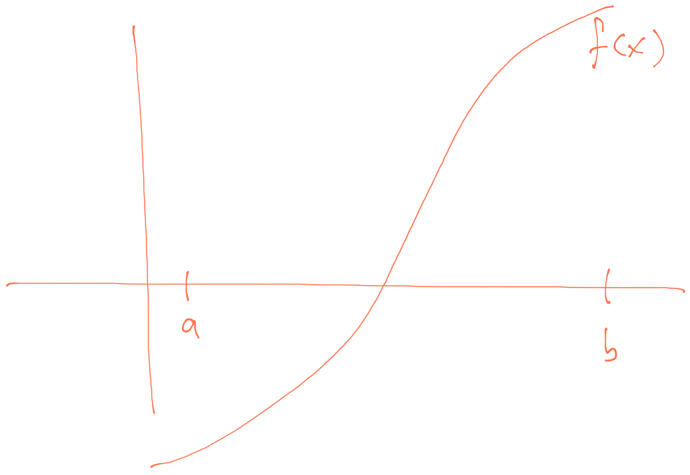
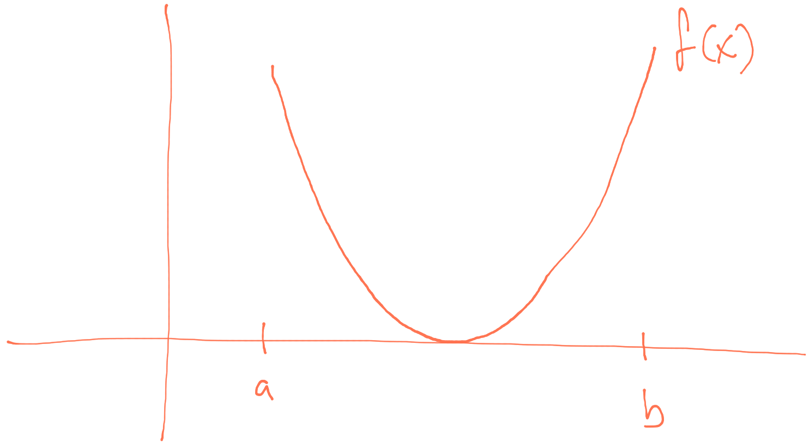
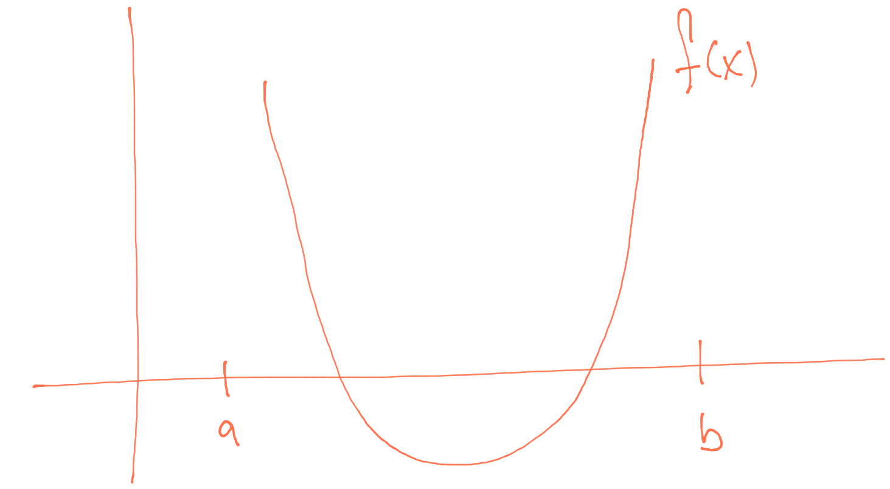
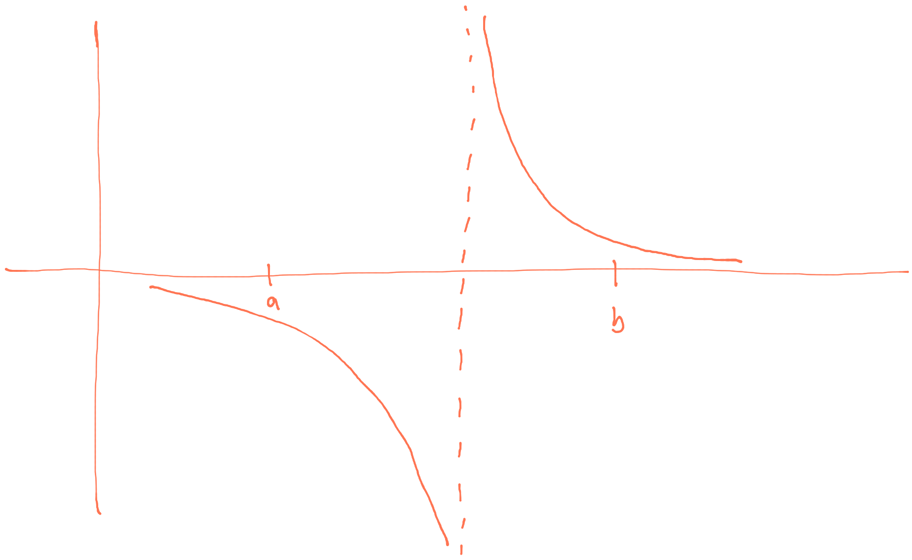

# Solving Nonlinear Equations

## Bisection Algorithm

The bisection algorithm is a simple method for finding the roots of one-dimensional functions. The goal is to find a root $x_0\in[a, b]$ such that $f(x_0)=0$. The algorithm starts with a large interval, known to contain $x_0$, and then successively reduces the size of the interval until it brackets the root. The theoretical underpinning of the algorithm is the [intermediate value theorem](https://en.wikipedia.org/wiki/Intermediate_value_theorem) which states that if a continuous function $f$ takes values $f(a)$ and $f(b)$ at the end points of the interval $[a, b]$, then $f$ must take all values between $f(a)$ and $f(b)$ somewhere in the interval. So if $f(a) < \gamma < f(b)$, then there exists a $c\in[a, b]$ such that $f(c)=\gamma$.

Using this information, we can present the bisection algorithm. First we must check that $\text{sign}(f(a)) \ne \text{sign}(f(b))$. Otherwise, the interval does not contain the root and might need to be widened. Then we can proceed:

1. Let $c = \frac{a + b}{2}$.

2. If $f(c) = 0$, stop and return $c$.

3. If $\text{sign}(f(a))\ne\text{sign}(f(c))$, then set $b\leftarrow c$. Else if $\text{sign}(f(b))\ne\text{sign}(f(c))$, then set $a\leftarrow c$.

4. Goto the beginning and repeat until convergence (see below).

After $n$ iterations, the size of the interval bracketing the root will be $2^{-n}(b-a)$.

The bisection algorithm is useful, conceptually simple, and is easy to implement. In particular, you do not need any special information about the function $f$ except the ability to evaluate it at various points in the interval. The downsides are that it is only useful in one dimension and its convergence is linear, which is the slowest rate of convergence for algorithms we will discuss (more on that later).

The bisection algorithm can run into problems in situations where the function $f$ is not well behaved. The ideal situation for the bisection algorithm looks something like this.



Here, $f(a)$ and $f(b)$ are of opposite signs and the root is clearly in between $a$ and $b$.

In the scenario below, the algorithm will not start because $f(a)>0$ and $f(b)>0$.




In this next scenario, there are two roots between $a$ and $b$, in addition to having $f(a)>0$ and $f(b)>0$. One would need to reduce the length of the starting interval in order to find either root.



In the scenario below, the algorithm will start because $f(a)$ and $f(b)$ are of opposite sign, but there is no root.



Convergence of the bisection algorithm can be determined by either having $|b-a|<\varepsilon$ for some small $\varepsilon$ or having $|f(b)-f(a)|<\varepsilon$. Which criterion you use will depend on the specific application and on what kinds of tolerances are required. 


### Example: Quantiles

Given a cumulative distribution function $F(x)$ and a number $p\in (0, 1)$, a quantile of $F$ is a number $x$ such that $F(x) = p$. The bisection algorithm can be used to find a quantile $x$ for a given $p$ by defining the function $g(x) = F(x) - p$ and solving for the value of $x$ that achieves $g(x) = 0$.

Another way to put this is that we are inverting the CDF to compute $x = F^{-1}(p)$. So the bisection algorithm can be used to invert functions in these situations.


## Rates of Convergence

One of the ways in which algorithms will be compared is via their rates of convergence to some limiting value. Typically, we have an interative algorithm that is trying to find the maximum/minimum of a function and we want an estimate of how long it will take to reach that optimal value. There are three rates of convergence that we will focus on here---linear, superlinear, and quadratic---which are ordered from slowest to fastest.

In our context, rates of convergence are typically determined by how much information about the target function $f$ we use in the updating process of the algorithm.  Algorithms that use little information about $f$, such as the bisection algorithm, converge slowly. Algorithms that require more information about $f$, such as derivative information, typically converge more quickly. There is no free lunch! 

### Linear convergence

Suppose we have a sequence $\{x_n\}$ such that $x_n\rightarrow x_\infty$ in $\mathfrak{R}^k$. We say the convergence is *linear* if there exists $r\in(0, 1)$ such that 

\[
\frac{\|x_{n+1}-x_\infty\|}{\|x_n-x_\infty\|}\leq r
\]
for all $n$ sufficiently large.

#### Example

The simple sequence $x_n = 1 + \left(\frac{1}{2}\right)^n$ converges linearly to $x_\infty = 1$ because

\[
\frac{\|x_{n+1}-x_\infty\|}{\|x_n-x_\infty\|}
=
\frac{\left(\frac{1}{2}\right)^{n+1}}{\left(\frac{1}{2}\right)^n}
=
\frac{1}{2}
\]
which is always in $(0, 1)$.

### Superlinear Convergence

We say a sequence $\{x_n\}$ converges to $x_\infty$ *superlinearly* if we have
\[
\lim_{n\rightarrow\infty} \frac{\|x_{n+1}-x_\infty\|}{\|x_n-x_\infty\|}
=
0
\]

The sequence above does not converge superlinearly because the ratio is always constant, and so never can converge to zero as $n\rightarrow\infty$. However, the sequence $x_n = 1 + \left(\frac{1}{n}\right)^n$ converges superlinearly to $1$.


### Quadratic Convergence

Quadratic convergence is the fastest form of convergence that we will discuss here and is generally considered desirable if possible to achieve. We say the sequence converges at a *quadratic* rate if there exists some constant $0 < M < \infty$ such that 
\[
\frac{\|x_{n+1}-x_\infty\|}{\|x_n-x_\infty\|^2}\leq M
\]
for all $n$ sufficiently large.

Extending the examples from above, the sequence $x_n = 1 + \left(\frac{1}{n}\right)^{2^n}$ converges quadratically to $1$. With this sequence, we have

\[
\frac{\|x_{n+1}-x_\infty\|}{\|x_n-x_\infty\|^2}
=
\frac{\left(\frac{1}{n+1}\right)^{2^{n+1}}}{\left(\frac{1}{n}\right)^{(2^n)2}}
=
\left(\frac{n}{n+1}\right)^{2^{n+1}}
\leq
1
\]

### Example: Bisection Algorithm

For the bisection algorithm, the error that we make in estimating the root is $x_n = |b_n - a_n|$, where $a_n$ and $b_n$ represent the end points of the bracketing interval at iteration $n$. However, we know that the size of the interval in the bisection algorithm decreases by a half at each iteration. Therefore, we can write $x_n = 2^{-n}|b_0 - a_0|$ and we can write the rate of convergence as

\[
\frac{\|x_{n+1}-x_\infty\|}{\|x_n-x_\infty\|}
=
\frac{x_{n+1}}{x_n}
=
\frac{2^{-(n+1)}(b_0-a_0)}{2^{-n}(b_0-a_0)}
=
\frac{1}{2}
\]
Therefore, the error of the bisection algorithm converges linearly to $0$.


## Functional Iteration

We want to find a solution to the equation $f(x)=0$ for $f: \mathbb{R}^k\rightarrow \mathbb{R}$ and $x\in S\subset \mathbb{R}^k$. One approach to solving this problem is to characterize solutions as *fixed points* of other functions. For example, if $f(x_0) = 0$, then $x_0$ is a fixed point of the function $g(x)=f(x) + x$. Another such function might be $g(x) = x(f(x) + 1)$ for $x\ne 0$.

In some situations, we can construct a function $g$ and a sequence $x_n = g(x_{n-1})$ such that we have the sequence $x_n\rightarrow x_\infty$ where $g(x_\infty) = x_\infty$. In other words, the sequence of values $x_n$ converges to a fixed point of $g$. If this fixed point satisfies $f(x_\infty) = 0$, then we have found a solution to our original problem. 

When can such a functional iteration procedure work? The Shrinking Lemma gives us the conditions under which this type of sequence will converge.


### The Shrinking Lemma

The Shrinking Lemma gives conditions under which a sequence derived via functional iteration will converge to a fixed point. Let $M$ be a closed subset of a complete normed vector space and let $f: M\rightarrow M$ be a map. Assume that there exists a $K$, $0<K<1$, such that for all $x,y\in M$, 

\[
\|f(x)-f(y)\|\leq K\|x-y\|.
\]

Then $f$ has a unique fixed point, i.e. there is a unique point $x_0\in M$ such that $f(x_0) = x_0$.

*Proof*: The basic idea of the proof of this lemma is that for a give $x\in M$, we can construct a Cauchy sequence $\{f^n(x)\}$ that converges to $x_0$, where $f^n(x)$ represents the $n$th functional iteration of $x$, i.e. $f^2(x) = f(f(x))$.

Given $x\in M$, we can write

\[
\|f^2(x)-f(x)\| = \|f(f(x)) - f(x)\|\leq K\|f(x)-x\|.
\]

By induction, we can therefore write

\[
\|f(^{n+1}(x)-f^{n}(x)\|\leq K\|f^n(x)-f^{n-1}(x)\|\leq K^n\|f(x)-x\|.
\]

It then follows that

\begin{eqnarray*}
\|f^n(x)-x\| & \leq & \|f^{n}(x)-f^{n-1}(x)\| + \|f^{n-1}(x)-f^{n-2}(x)\| + \cdots + \|f(x)-x\|\\
& \leq & (K^{n-1} + K^{n-2} + \cdots + K)\|f(x)-x\|\\
& \leq & \frac{1}{1-K}\|f(x)-x\|.
\end{eqnarray*}

Given integers $m\geq 1$ and $k\geq 1$, we can write 

\begin{eqnarray*}
\|f^{m+k}(x)-f^k(x)\| & \leq & K^m\|f^k(x)-x\|\\
& \leq & K^m\frac{1}{1-K}\|f(x)-x\|
\end{eqnarray*}

Therefore, there exists some $N$ such that for all $m, n\geq N$ (say $n=m+k$), we have $\|f^n(x)-f^m(x)\|\leq\varepsilon$, because $K^m\rightarrow 0$ as $m\rightarrow\infty$. As a result, the sequence $\{f^n(x)\}$ is a Cauchy sequence, so let $x_0$ be its limit. 

Given $\varepsilon>0$, let $N$ be such that for all $n\geq N$, $\|f^n(x)-x_0\|\leq\varepsilon$. Then we can also say that for $n\geq N$,

\[
\|f(x_0) - f^{n+1}(x)\|\leq \|x_0-f^n(x)\|\leq\varepsilon
\]

So what we have is $\{f^n(x)\}\rightarrow x_0$ and we have $\{f^n(x)\}\rightarrow f(x_0)$. Therefore, $x_0$ is a fixed point of $f$, so that $f(x_0)=x_0$.

To show that $x_0$ is unique, suppose that $x_1$ is another fixed point of $f$. Then

\[
\|x_1-x_0\| = \|f(x_1)-f(x_0)\|\leq K\|x_1-x_0\|.
\]
Because $0<K<1$, we must have $x_0=x_1$.


### Convergence Rates for Shrinking Maps

Suppose $g$ satisfies

\[
|g(x)-g(y)|\leq K|x-y|
\]
for some $K\in (0,1)$ and any $x, y\in I$, a closed interval. Therefore, $g$ has a fixesd point at $x_\infty$. Assume $g$ is differentiable with $0<|g^\prime(x_\infty)|<1$, where $x_\infty$ is the fixed point of $g$. Then $x_n\rightarrow x_\infty$ linearly.

We can show that 

\[
\frac{|x_{n+1}-x_\infty|}{|x_n-x_\infty|}
=
\frac{|g(x_n)-g(x_\infty)|}{|x_n-x_\infty|}
\leq
K \frac{|x_n-x_\infty|}{|x_n-x_\infty|}.
\]

Because $K\in(0,1)$, this shows that convergence to $x_\infty$ is linear.


### Newton's Method

Newton's method build a sequence of values $\{x_n\}$ via functional iteration that converges to the root of a function $f$. Let that root be called $x_\infty$ and let $x_n$ be the current estimate. By the mean value theorem, we know there exists some $z$ such that
\[
f(x_n) = f^\prime(z)(x_n-x_\infty),
\]
where $z$ is somewhere between $x_n$ and $x_\infty$. Rearranging terms, we can write
\[
x_\infty = x_n-\frac{f(x_n)}{f^\prime(z)}
\]
Obviously, we do not know $x_\infty$ or $z$, so we can replace them with our next iterate $x_{n+1}$ and our current iterate $x_n$, giving us the Newton update formula,
\[
x_{n+1} = x_n - \frac{f(x_n)}{f^\prime(x_n)}.
\]

We will discuss Newton's method more in the later section on general optimization, as it is a core method for minimizing functions.

### Proof of Newton's Method

Newton's method can be written as a functional iteration that converges to a fixed point. Let $f$ be a function that is twice continuously differentiable and suppose there exists a $x_\infty$ such that $f(x_\infty) = 0$ and $f^\prime(x_\infty)\ne 0$. Then there exists a $\delta$ such that for any $x_0\in(x_\infty-\delta, x_\infty+\delta)$, the sequence
\[
x_n = g(x_{n-1}) = x_{n-1} - \frac{f(x_{n-1})}{f^\prime(x_{n-1})}
\]
converges to $x_\infty$.

Note that 
\begin{eqnarray*}
g^\prime(x) 
& = & 
1-\frac{f^\prime(x)f^\prime(x)-f(x)f^{\prime\prime}(x)}{[f^\prime(x)]^2}\\
& = & 
\frac{f(x)f^{\prime\prime}(x)}{[f^\prime(x)]^2}
\end{eqnarray*}
Therefore, $g^\prime(x_\infty) = 0$ because we assume $f(x_\infty) = 0$ and $f^\prime(x_\infty)\ne 0$. Further we know $g^\prime$ is continuous because we assumed $f$ was twice continuously differentiable.

Therefore, given $K < 1$, there exists $\delta > 0$ such that for all $x\in(x_\infty-\delta, x_\infty+\delta)$, we have $|g^\prime(x)|< K$. For any $a, b\in(x_\infty-\delta, x_\infty+\delta)$ we can also write
\begin{eqnarray*}
|g(a)-g(b)| 
& \leq & 
|g^\prime(c)||a-b|\\
& \leq & 
K|a-b|
\end{eqnarray*}

In the interval of $x_\infty\pm\delta$ we have that $g$ is a shrinking map. Therefore, there exists a unique fixed point $x_\infty$ such that $g(x_\infty)=x_\infty$. This value $x_\infty$ is a root of $f$. 


### Convergence Rate of Newton's Method

Although proof of Newton's method's convergence to a root can be done using the Shrinking Lemma, the convergence rate of Newton's method is considerably faster than the linear rate of generic shrinking maps. This fast convergence is obtained via the additional assumptions we make about the smoothness of the function $f$.

Suppose again that $f$ is twice continuously differentiable and that there exists $x_\infty$ such that $f(x_\infty) = 0$. Given some small $\varepsilon > 0$, we can approximate $f$ around $x_\infty$ with
\begin{eqnarray*}
f(x_\infty+\varepsilon)
& = & 
f(x_\infty) + \varepsilon f^\prime(x_\infty)+\frac{\varepsilon^2}{2}f^{\prime\prime}(x_\infty) + O(\varepsilon^2)\\
& = & 
0 + \varepsilon f^\prime(x_\infty)+\frac{\varepsilon^2}{2}f^{\prime\prime}(x_\infty) + O(\varepsilon^2)
\end{eqnarray*}

Additionally, we can approximate $f^\prime$ with
\[
f^\prime(x_\infty+\varepsilon) 
=
f^\prime(x_\infty) + \varepsilon f^{\prime\prime}(x_\infty) + O(\varepsilon)
\]

Recall that Newton's method generates the sequence
\[
x_{n+1} = x_n - \frac{f(x_n)}{f^\prime(x_n)}.
\]

Using the time-honored method of adding and subtracting, we can write this as
\[
x_{n+1} - x_\infty = x_n - x_\infty - \frac{f(x_n)}{f^\prime(x_n)}.
\]

If we let $\varepsilon_{n+1}=x_{n+1} - x_\infty$ and $\varepsilon_n=x_n - x_\infty$, then we can rewrite the above as
\[
\varepsilon_{n+1} = \varepsilon_n - \frac{f(x_n)}{f^\prime(x_n)}
\]

Further adding and subtracting (i.e. $x_n = x_\infty + \varepsilon_n$) gives us
\[
\varepsilon_{n+1} = \varepsilon_n - \frac{f(x_\infty+\varepsilon_n)}{f^\prime(x_\infty+\varepsilon_n)}
\]

From here, we can use the approximations written out earlier to give us
\begin{eqnarray*}
\varepsilon_{n+1}
& \approx &
\varepsilon_n - \frac{\varepsilon_n f^\prime(x_\infty) + \frac{\varepsilon_n^2}{2}f^{\prime\prime}(x_\infty)}{f^\prime(x_\infty)+\varepsilon_n f^{\prime\prime}(x_\infty)}\\
& = & 
\varepsilon_n^2\left(\frac{\frac{1}{2}f^{\prime\prime}(x_\infty)}{f^\prime(x_\infty) + \varepsilon_n f^{\prime\prime}(x_\infty)}\right)
\end{eqnarray*}

Dividing by $\varepsilon_n^2$ on both sides gives us
\[
\frac{\varepsilon_{n+1}}{\varepsilon_n^2}
\approx
\frac{\frac{1}{2}f^{\prime\prime}(x_\infty)}{f^\prime(x_\infty) + \varepsilon_n f^{\prime\prime}(x_\infty)}
\]

As $\varepsilon_n\downarrow 0$, we can say that there exists some $M<\infty$ such that
\[
\frac{|\varepsilon_{n+1}|}{|\varepsilon_n|}
\leq
M
\]
as $n\rightarrow\infty$, which is the definition of quadratic convergence. Of course, for this to work we need that $f^{\prime\prime}(x_\infty)<\infty$ and that $f^\prime(x_\infty)\ne 0$. 

In summary, Newton's method is very fast in the neighborhood of the root and furthermore has a direct multivariate generalization (unlike the bisection method). However, the need to evaluate $f^\prime$ at each iteration requires more computation (and more assumptions about the smoothness of $f$). Additionally, Newton's method can, in a sense, be "too fast" in that there is no guarantee that each iteration of Newton's method is an improvement (i.e. is closer to the root). In certain cases, Newton's method can swing wildly out of control and diverge. Newton's method is only guaranteed to converge in the neighborhood of the root; the exact size of that neighborhood is usually not known.

### Newton's Method for Maximum Likelihood Estimation

In many statistical modeling applications, we have a likelihood function $L$ that is induced by a probability distribution that we assume generated the data. This likelihood is typically parameterized by a vector $\theta$ and maximizing $L(\theta)$ provides us with the *maximum likelihood estimate* (MLE), or $\hat{\theta}$. In practice, it makes more sense to maximize the log-likehood function, or $\ell(\theta)$, which in many common applications is equivalent to solving the *score equations* $\ell^\prime(\theta) = 0$ for $\theta$.

Newton's method can be applied to generate a sequence that converges to the MLE $\hat{\theta}$. If we assume $\theta$ is a $k\times 1$ vector, we can iterate
\[
\theta_{n+1}
=
\theta_n - \ell^{\prime\prime}(\theta_n)^{-1}\ell^\prime(\theta_n)
\]
where $\ell^{\prime\prime}$ is the Hessian of the log-likelihood function.

Note that the formula above computes an inverse of a $k\times k$ matrix, which should serve as an immediate warning sign that this is **not** how the algorithm should be implemented. In practice, it may make more sense to solve the system of equations
\[
[\ell^{\prime\prime}(\theta_n)]\theta_{n+1}
=
[\ell^{\prime\prime}(\theta_n)]\theta_n-\ell^\prime(\theta_n).
\]
rather than invert $\ell^{\prime\prime}(\theta_n)$ directly at every iteration.

However, it may make sense to invert $\ell^{\prime\prime}(\theta_n)$ at the very end of the algorithm to obtain the *observed information matrix* $-\ell^{\prime\prime}(\hat{\theta})$. This observed information matrix can be used to obtain asymptotic standard errors for $\hat{\theta}$ for making inference about $\theta$. 


#### Example: Estimating a Poisson Mean

Suppose we observe data $x_1, x_2, \dots, x_n\stackrel{iid}{\sim}\text{Poisson}(\mu)$ and we would like to estimate $\mu$ via maximum likelihood. The log-likelihood induced by the Poisson model is
\[
\ell(\mu)
=
\sum_{i=1}^n
x_i\log\mu - \mu
=
n\bar{x}\log\mu - n\mu
\]
The score function is
\[
\ell^\prime(\mu)
=
\frac{n\bar{x}}{\mu}-n
\]
It is clear that setting $\ell^\prime(\mu)$ to zero and solving for $\mu$ gives us that $\hat{\mu}=\bar{x}$. However, we can visualizing $\ell^\prime(\mu)$ and see how the Newton iteration would work in this simple scenario.

```{r}
set.seed(2017-08-09)
x <- rpois(100, 5)
xbar <- mean(x)
n <- length(x)
score <- function(mu) {
        n * xbar / mu - n
}
curve(score, .3, 10, xlab = expression(mu), ylab = expression(score(mu)))
abline(h = 0, lty = 3)
```

The figure above shows that this is clearly a nice smooth function for Newton's method to work on. Recall that for the Newton iteration, we also need the second derivative, which in this case is
\[
\ell^{\prime\prime}(\mu)
=
-\frac{n\bar{x}}{\mu^2}
\]

So the Newton iteration is then
\begin{eqnarray*}
\mu_{n+1}
& = & 
\mu_n - \left[-\frac{n\bar{x}}{\mu_n^2}\right]^{-1}\left(\frac{n\bar{x}}{\mu_n}-n
\right)\\
& = & 
2\mu_n-\frac{\mu_n^2}{n}
\end{eqnarray*}

Using the functional programmign aspects of R, we can write a function that executes the functional iteration of Newton's method for however many times we which to run the algorithm.

```{r}
Funcall <- function(f, ...) f(...)

## This creates takes a function as argument and generates an 
## "iterator" version of it where the number of iterations is 
## an argument
Iterate <- function(f, n = 1) {
        function(x) {
                Reduce(Funcall, rep.int(list(f), n), x, right = TRUE)
        }
}
single_iteration <- function(x) {
        2 * x - x^2 / xbar
}
g <- function(x0, n) {
        giter <- Iterate(single_iteration, n)
        giter(x0)
}

## Allow for vector "n" argument (mainly for plotting)
g <- Vectorize(g, "n")
```

Let's use a starting point of $\mu_0 = 10$. We can plot the score function along with the values of each of the Newton iterates for 7 iterations.

```{r}
par(mar = c(5, 5, 4, 1))
curve(score, .35, 10, xlab = expression(mu), ylab = expression(score(mu)), cex.axis = 0.8)
abline(h = 0, lty = 3)

## Generate values for 7 functional iterations with a starting value of 10
iterates <- g(10, 1:7)  
abline(v = c(10, iterates), lty = 2)
axis(3, c(10, iterates), labels = c(0, 1:7), cex = 2, cex.axis = 0.8)
mtext("Iteration #", at = 2, line = 2.5)
```

We can see that by the 7th iteration we are quite close to the root, which in this case is `r xbar`.

Another feature to note of Newton's algorithm here is that when the function is relatively flat, the algorithm makes large moves either to the left or right. However, when the function is relatively steep, the moves are smaller in distance. This makes sense because the size of the deviation from the current iterate depends on the inverse of $\ell^{\prime\prime}$ at the current iterate. When $\ell^\prime$ is flat, $\ell^{\prime\prime}$ will be small and hence its inverse large.


