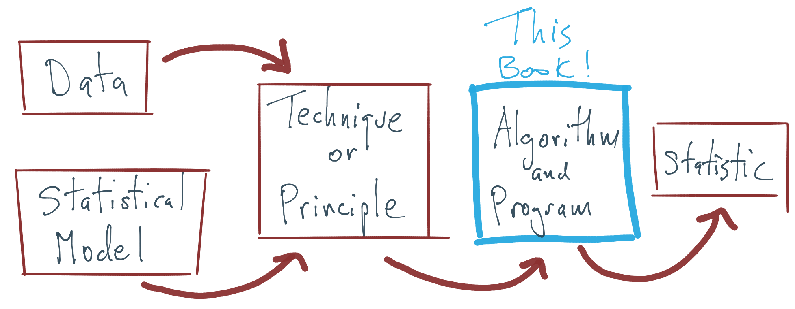

# Introduction


```{r,include=FALSE}
knitr::opts_chunk$set(comment = NA, fig.path = "image/")
```


The journey from statistical model to useful output has many steps, most of which are taught in other books and courses. The purpose of this book is to focus on one particular aspect of this journey: the development and implementation of statistical algorithms. 



## Example: Linear Models

Consider the simple linear model. 
\begin{equation}
y = \beta_0 + \beta_1 x + \varepsilon
(\#eq:regression)
\end{equation}

This model has unknown parameters $\beta_0$ and $\beta_1$. Given observations $(y_1, x_1), (y_2, x_2),\dots, (y_n, x_n)$, we can combine these data with the *likelihood principle*, which gives us a procedure for producing model parameter estimates. The likelihood can be *maximized* to produce *maximum likelihood estimates*,
\[
\hat{\beta}_0 = \bar{} - \hat{\beta}_1\bar{x}
\]
and
\[
\hat{\beta}_1 
= 
\frac{\sum_{i=1}^n (x_i-\bar{x})(y_i-\bar{y})}{\sum_{i=1}^n (x_i-\bar{x})}
\]
These *statistics*, $\hat{\beta}_0$ and $\hat{\beta}_1$, can then be interpreted, depending on the area of application, or used for other purposes, perhaps as inputs to other procedures. In this simple example, we can see how each component of the modeling process works.

| Component | Implementation | 
| :-------- | :------------- |
| Model | Linear regression |
| Principle/Technique | Likelihood principle | 
| Algorithm | Maximization |
| Statistic | $\hat{\beta}_0$, $\hat{\beta}_1$ |

In this example, the maximization of the likelihood was simple because the solution was available in closed form. However, in most other cases, there will not be a closed form solution and some specific algorithm will be needed to maximize the likelihood.

Changing the implementation of a given component can lead to different outcomes further down the change and can even produce completely different outputs. Identical estimates for the parameters in this model can be produced (in this case) by replacing the likelihood principle with the principle of least squares. However, changing the principle to produce, for example, maximum *a posteriori* estimates would have produced different statistics at the end.


## Principle of Optimization Transfer

There is a general principle that will be repeated in this book that Kenneth Lange calls "optimization transfer". The basic idea applies to the problem of maximizing a function $f$.

1. We want to maximize $f$, but it is difficult to do so.

2. We *can* compute an approximation to $f$, call it $g$, based on local information about $f$.

3. Instead of maximizing $f$, we "transfer" the maximization problem to $g$ and maximize $g$ instead.

4. We iterate Steps 2 and 3 until convergence.

The difficult problem of maximizing $f$ is replaced with the simpler problem of maximizing $g$ coupled with *iteration* (otherwise known as computation). This is the optimization "transfer".

Note that all of the above applies to minimization problems, because maximizing $f$ is equivalent to minimizing $-f$.


## Textbooks vs. Computers

One confusing aspect of statistical computing is that often there is a disconnect between what is printed in a statistical computing textbook and what *should* be implemented on the computer. In textbooks, it is usually simpler to present solutions as convenient mathematical formulas whenever possible, in order to communicate basic ideas and to provide some insight. However, directly translating these formulas into computer code is usually not advisable because there are many problematic aspects of computers that are simply not relevant when writing things down on paper. 

Some key issues to look for when implementing statistical or numerical solutions on the computer are

1. Overflow - When numbers get too big, they cannot be represented on a computer and so often `NA`s are produced instead;

2. Underflow - Similar to overflow, numbers can get too small for computers to represent, resulting in errors or warnings or inaccurate computation;

3. Near linear dependence - the existence of linear dependence in matrix computations depends on the precision of a machine. Because computers are finite precision, there are commonly situations where one might think there is no linear dependence but the computer cannot tell the difference.

All three of the above problems arise from the finite precision nature of all computers. One must take care to use algorithms that do calculations in the computable range and that automatically handle things like near dependence.

Below, I highlight two common examples in statistics where the implementation diverges from what textbooks explain as the solution: The least squares solution to the linear regression estimation problem and the computation of the multivariate Normal density. Both problems, on paper, involve inverting a matrix, which is typically a warning sign in any linear algebra problem. While matrix inverses are commonly found in statistics textbooks, it's rare in practice that you will ever want to directly compute them. This point bears repeating: **If you find yourself computing the inverse of a matrix, there is usually a better way of doing whatever you are trying to do**.


### Linear Regression

The typical linear regression model, written in matrix form, is represented as follows,

\[
y = X\beta + \varepsilon
\]
where $y$ is an $n\times 1$ observed response, $X$ is the $n\times p$ predictor matrix, $\beta$ is the $p\times 1$ coefficient vector, and $\varepsilon$ is $n\times 1$ error vector.

In most textbooks the solution for estimating $\beta$, whether it be via maximum likelihood or least squares, is written as

\[
\hat{\beta} = (X^\prime X)^{-1}X^\prime y.
\]
And indeed, that *is* the solution. In R, this could be translated literally as

```r
betahat <- solve(t(X) %*% X) %*% t(X) %*% y
```
where `solve()` is used to invert the cross product matrix $X^\prime X$. However, one would never compute the actual value of $\hat{\beta}$ this way on the computer. The formula presented above is *only* computed in textbooks.

The primary reason is that computing the direct inverse of $X^\prime X$ is very expensive computationally and is a potentially unstable operation on a computer when there is high colinearity amongst the predictors. Furthermore, in computing $\hat{\beta}$ we do not actually need the inverse of $X^\prime X$, so why compute it? A simpler approach would be to take the normal equations,
\[
X^\prime X\beta = X^\prime y
\]
and solve them directly. In R, we could write

```r
solve(crossprod(X), crossprod(X, y))
```

Rather than compute the inverse of $X^\prime X$, we directly compute $\hat{\beta}$ via [Gaussian elimination](https://en.wikipedia.org/wiki/LU_decomposition). This approach has the benefit of being more numerically stable and being *much* faster.

```{r, cache=TRUE}
set.seed(2017-07-13)
X <- matrix(rnorm(5000 * 100), 5000, 100)
y <- rnorm(5000)

## Naive computation
library(microbenchmark)
microbenchmark(solve(t(X) %*% X) %*% t(X) %*% y)
```


The following timing uses the `solve()` function to compute $\hat{\beta}$ via Gaussian elimination.
```{r,cache=TRUE}
microbenchmark(solve(t(X) %*% X) %*% t(X) %*% y,
               solve(crossprod(X), crossprod(X, y)))
```

You can see that the betweeen the two approach there is a more than 5-fold difference in computation time, with the second approach being considerably faster.


However, this approach breaks down when there is any colinearity in the $X$ matrix. For example, we can tack on a column to $X$ that is very similar (but not identical) to the first column of $X$.

```{r,error=TRUE}
W <- cbind(X, X[, 1] + rnorm(5000, sd = 0.0000000001))
solve(crossprod(W), crossprod(W, y))
```

Now the approach doesn't work because the cross product matrix $W^\prime W$ is singular. In practice, matrices like these can come up a lot in data analysis and it would be useful to have a way to deal with it automatically.

R takes a different approach to solving for the unknown coefficients in a linear model. R uses the [QR decomposition](https://en.wikipedia.org/wiki/QR_decomposition), which is not as fast, but has the added benefit of being able to automatically detect and handle colinear columns in the matrix.

Here, we use the fact that $X$ can be decomposed as $X = QR$, where $Q$ is an orthonormal matrix and $R$ is an upper triangular matrix. Given that, we can write

\[
X^\prime X\beta = X^\prime y
\]
as
\begin{eqnarray*}
R^\prime Q^\prime QR\beta & = & R^\prime Q^\prime y\\
R^\prime R\beta & = & R^\prime Q^\prime y\\
R\beta & = & Q^\prime y
\end{eqnarray*}
because $Q^\prime Q = I$. At this point, we can solve for $\beta$ via Gaussian elimination, which is greatly simplified because $R$ is already upper triangular.
The QR decomposition has the added benefit that we do not have to compute the cross product $X^\prime X$ at all, as this matrix can be numericaly unstable if it is not properly centered or scaled.

We can see in R code that even with our singular matrix `W` above, the QR decomposition continues without error.

```{r}
Qw <- qr(W)
str(Qw)
```

Note that the output of `qr()` computes the rank of $W$ to be 100, not 101, because of the colinear column. From there, we can get $\hat{\beta}$ if we want using `qr.coef()`,

```{r}
betahat <- qr.coef(Qw, y)
```

We do not show it here, but the very last element of `betahat` is `NA` because a coefficient corresponding to the last column of $W$ (the collinear column) could not be calculated.

While the QR decomposition does handle colinearity, we do pay a price in speed.
```{r,cache=TRUE}
library(ggplot2)
m <- microbenchmark(solve(t(X) %*% X) %*% t(X) %*% y,
                    solve(crossprod(X), crossprod(X, y)),
                    qr.coef(qr(X), y))
autoplot(m)
```

Compared to the approaches above, it is comparable to the naive approach but it is a much better and more stable method.  

In practice, we do not use functions like `qr()` or `qr.coef()` directly because higher level functions like `lm()` do the work for us. However, for certain narrow, highly optimized cases, it may be fruitful to turn to another matrix decomposition to compute linear regression coefficients, particularly if this must be done repeatedly in a loop.


### Multivariate Normal Distribution

Computing the multivariate normal density is a common problem in statistics, such as in fitting spatial statistical models or Gaussian process models. Because optimization procedures used to compute maximum likelihood estimates or likelihood ratios can be evaluated hundreds or thousands of times in a single run, it's useful to have a highly efficient procedure for evaluating the multivariate Normal density.

The $p$-dimensional multivariate Normal density is written as

\[
\varphi(x\mid\mu,\Sigma)
=
-\frac{p}{2}\log 2\pi-\frac{1}{2}\log|\Sigma| - \frac{1}{2}(x-\mu)^\prime\Sigma^{-1}(x-\mu)
\]

The critical, and most time-consuming, part of computing the multivariate Normal density is the quadratic form,
\[
(x-\mu)^\prime\Sigma^{-1}(x-\mu).
\]
We can simplify this problem a bit by focusing on the centered version of $x$ which we will refer to as $z=x-\mu$. Hence, we are trying to compute
\[
z^\prime\Sigma^{-1}z
\]

Here, much like the linear regression example above, the key bottleneck is the inversion of the $p$-dimensional covariance matrix $\Sigma$. If we take $z$ to be a $p\times 1$ column vector, then a literal translation of the mathematics into R code might look something like this,

```r
t(z) %*% solve(Sigma) %*% z
```

But once again, we are taking on the difficult and unstable task of inverting $\Sigma$ when, at the end of the day, we do not need this inverse.

Instead of taking the textbook translation approach, we can make use of the Cholesky decomposition of $\Sigma$. The Cholesky decomposition of a positive definite matrix provides

\[
\Sigma = R^\prime R
\]

where $R$ is an upper triangular matrix. $R$ is sometimes referred to as the "square root" of $\Sigma$ (although it is not unique). Using the Cholesky decomposition of $\Sigma$ and the rules of matrix algebra, we can then write

\begin{eqnarray*}
z^\prime\Sigma^{-1}z 
& = & 
z^\prime (R^\prime R)^{-1}z\\
& = & 
z^\prime R^{-1}R^{\prime -1}z\\
& = &
(R^{\prime -1}z)^\prime R^{\prime -1}z\\
& = &
v^\prime v
\end{eqnarray*}
where $v = R^{\prime -1} z$ and is a $p\times 1$ vector. Furthermore, we can avoid inverting $R^\prime$ by computing $v$ as the solution to the linear system
\[
R^\prime v = z
\]
Once we have computed $v$, we can compute the quadratic form as $v^\prime v$, which is simply the cross product of two $p$-dimensional vectors!

Another benefit of the Cholesky decomposition is that it gives us a simple way to compute the log-determinant of $\Sigma$. The log-determinant of $\Sigma$ is simply $2$ times the sum of the log of the diagonal elements of $R$.

Here is an implementation of the naive approach to computing the quadratic form in the multivariate Normal.

```{r}
set.seed(2017-07-13)
z <- matrix(rnorm(200 * 100), 200, 100)
S <- cov(z)
quad.naive <- function(z, S) {
        Sinv <- solve(S)
        rowSums((z %*% Sinv) * z)
}
```


We can first take a look at the output that this function produces.
```{r,message=FALSE}
library(dplyr)
quad.naive(z, S) %>% summary
```


The following is a version of the quadratic form function that uses the Cholesky decomposition.

```{r}
quad.chol <- function(z, S) {
        R <- chol(S)
        v <- backsolve(R, t(z), transpose = TRUE)
        colSums(v * v)
}
```

We can verify that this function produces the same output as the naive version.
```{r}
quad.chol(z, S) %>% summary
```


Now, we can time both procedures to see how they perform.
```{r}
library(microbenchmark)
microbenchmark(quad.naive(z, S), quad.chol(z, S))
```

We can see that the version using the Cholesky decomposition takes about 60% of the time of the naive version. In a single evaluation, this may not amount to much time. However, over the course of potentially many iterations, these kinds of small savings can add up.

The key lesson here is that our use of the Cholesky decomposition takes advantage of the fact that we know that the covariance matrix in a multivariate Normal is symmetric and positive definite. The naive version of the algorithm that just blindly inverts the covariance matrix is not able to take advantage of this information.


